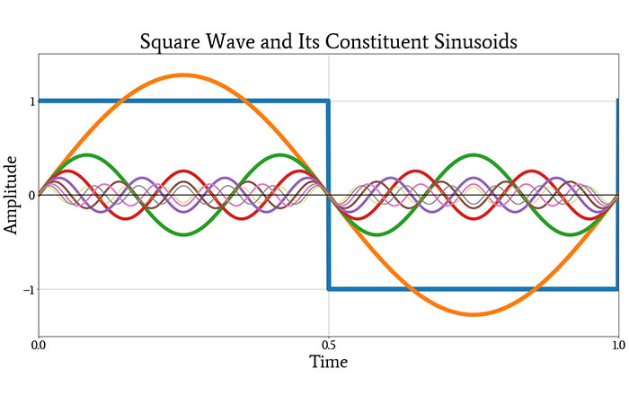

# Trigonometry and SOHCAHTOA

## Trigonmetry

### Fundamental of trig

* **Galileo Galilei** was the inventor of Trigonometry as we know it today, he was bored looking at a pendulum ina catherdral one morning and then here we are
* All functions are an axiom of y = f\(x\), trig functions included
  * Sin's real function can be found [here](https://mathworld.wolfram.com/Sine.html)
* [Circular phasor](https://www.youtube.com/watch?v=a_zReGTxdlQ) instructs that \(sin\) circles = \(sin\) waves
  * Also proves the radians units, as 2 pi is the circumference
  * This brings about the equation w = 2 pi f
    * where w is the angular frequency \(radians\)
    * f is the frequency
* Trig, especially sin, just appears in nature everywhere, thus super useful 
* A circle is 360 degrees because we chose it to be so it is easy to divide
  * In game dev, they choose 256 degrees to store circles into one byte
* The  domain for sin can be displayed as
  * R: -1 &lt;= r &lt;= 1

$$
1^* =  \tfrac{2pi}{f}
$$

* When involving sin with time, we get 

$$
f(t) = sin(wt) = sin(2pi*f)
$$

* Tan has asymptotes cause it is equal to sin/cos, and when cos = 0, than will be equal to infinity, negative infinity, or zero, it is unsolvable, thus we write a zero.
  * so its co domain would be
    * R: \(-ve\)infinity &lt;= r &lt;= \(+ve\)infinity 
* There are also reciprocal functions

$$
cot =  \tfrac{1}{tan} \space \space \space | \space \space \space cosec =  \tfrac{1}{sin} \space \space \space | \space \space \space sec =  \tfrac{1}{tan}= \tfrac{cos}{sin}
$$

* There are also inverse functions

$$
sin^{-1} \space \space \space | \space \space \space cos^{-1} \space \space \space | \space \space \space tan^{-1}
$$

* Triangles are important because every other shape is built on them, they are the fundamental triangles

### **Fourier Transformation**

* **Fourier transform** is a coordinate transformation
* It derives originates from the heat equation
* It is now used in image compression, solvbing other partial differential equations
* So we can approximate a sum, as a sum of sin and cosine
* So the sin graph can be represented as a sum of sine and cosine, this isnt bound to sine graphs, it applies to all functions within a 2D space

* **Fourier analysis** is the study of the way general functions may be represented or approximated by sums of simpler trigonometric functions
* The most basic\(fundemental\) sine wave has a frequency of 1Hz
* Digital communication is built on the FAST FOURIER TRANSFORM
  * sending pictures
  * audio clips
  * even sattelite communication

### SOHCAHTOA

* SOHCAHTOA exists cause of the trig circles, where if you draw a **right angled triangle** that constitutes 2 radius'. you get an unknown angle in the center between the radius' that is equal to tan\(o/a\)
  * Thus triangles map to circles in trig

### Trig Identities

## Misc

* Computers can't actually generate random numbers, this problem is uncomputable, as us humans wrote the program, thus not random
  * maybe it takes the date time and squares it
  * maybe it looks at the current free memory locations
* Point is, there is an inverse function, it's just made so the users cannot see, thus appearing random

## Worksheets

| Worksheet Questions | Worksheet Answers | Worked Solutions |
| :--- | :--- | :--- |
| [TrigIdentitiesQuestions](https://github.com/AdnanTech/maths-for-computing-worksheets/blob/master/trigonometry-and-sohcahtoa/TrigIdentitiesQuestions.pdf) | [TrigIdentitiesAnswers](https://github.com/AdnanTech/maths-for-computing-worksheets/blob/master/trigonometry-and-sohcahtoa/TrigIdentitiesAnswers.pdf) | TrigIdentitiesWorkedSolutions |
| [SOHCAHTOAQuestions](https://github.com/AdnanTech/maths-for-computing-worksheets/blob/master/trigonometry-and-sohcahtoa/SOHCAHTOAQuestionsandAnswers.pdf) | [SOHCAHTOAAnswers](https://github.com/AdnanTech/maths-for-computing-worksheets/blob/master/trigonometry-and-sohcahtoa/SOHCAHTOAQuestionsandAnswers.pdf) | SOHCAHTOAWorkedSolutions |

