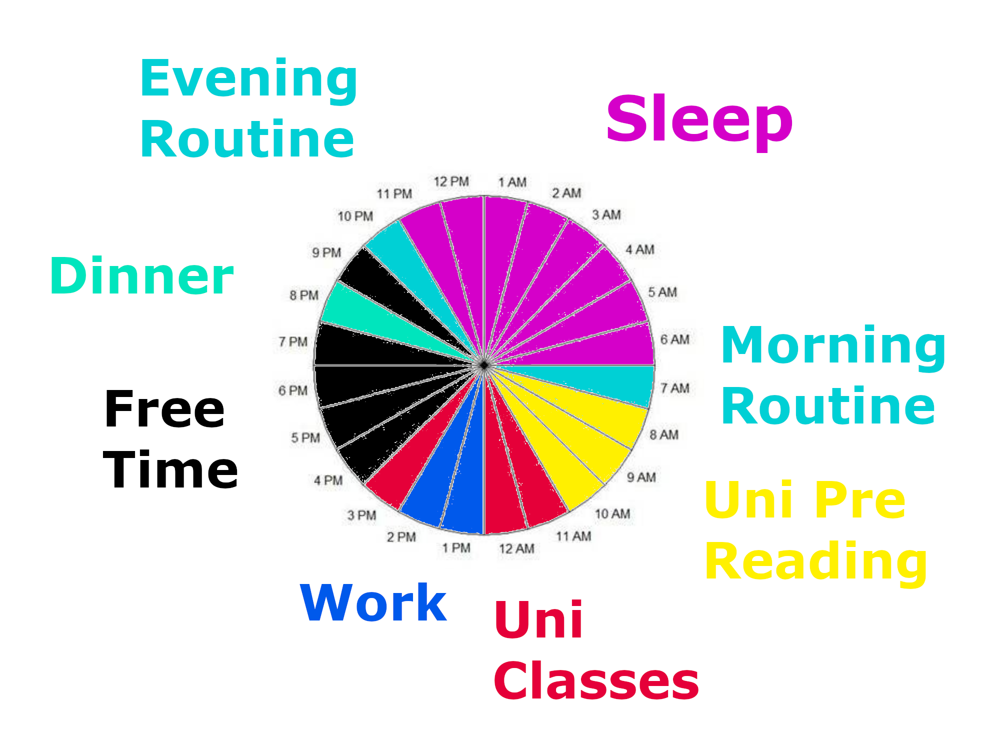

# Time Circles

These are my time circles, where I will experiment recording my events, in the form of time, during a 24 hour period, in order to get better at time management.This test begins the week beginning 26/10/2020 and will end  1/11/2020

## 26/10/2020

### Evalutation

* Morning session from 8-9 can get very unfocused, I tend to drift, checking messages and emails. This could be as I am not writing down defined objectives, merely "University pre reading" instead.
* Around 9:30 I got into the flow of things, turning off WhatsApp notifications and making great progress on my [group work](group-work.md)
* After my lecture finished at 1pm, I pranced around and eased my mind and body for 45 mins, considering commuting for my 3pm class takes 15 minutes, this means I was only able to do an hour of work, leaving another hour to be made up for in the afternoon.
* I can get distracted with YouTube **comments** and **recommendations** easily
* I also get distracted by my phone
* After my class finished at 4pm, commute home took 20 minutes, eating and hanging up clothes etc took 20, and marking my little brothers homework also took 20 minutes
* Currently 5pm, this leaves me with 3 hours of free time left, as one hour is the work that I still need to do.
* Did an hour of work from 5-6, then a work call that lasted 30 mins. So i have from 6:30 onwards as free time.

## 26/10/2020

