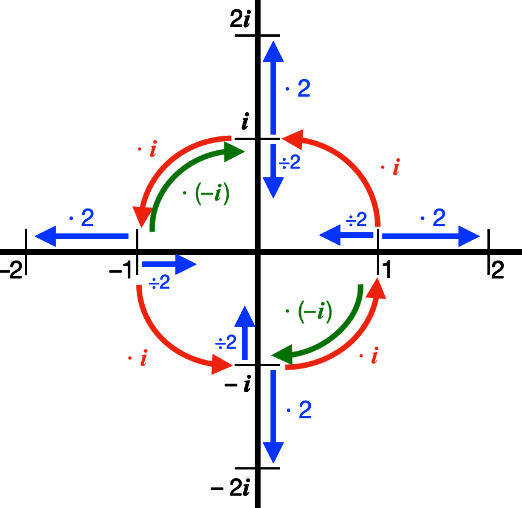

# Number Sets

## ℕ - Natural Numbers

ℕ stands for a **natural **number. 

A natural number is any number that\
 may be obtained from 0, by applying the “**successor function**”$$S(n)= n+1$$ a finite number of times.

If 0 is not included, one might write $$N_+$$or more often: $$Z_+$$ . However, in this course, we DO include zero as a natural number.

This encapsulates $$\{0,1,2,3,...\}$$ as well as the operations ( /, \*, +. - \[Where \* is a dot in the middle]). A general rule of thumb is that if you  add or multiply two natural numbers, the result is another natural number.

ℕ is closed under addition and multiplication”. ℕ is not closed under subtraction or division: 3−5 ∉ ℕ and 1/3 ∉ ℕ.

## ℤ - Integers

ℤ stands for **integers. **This involves { …, -2, -1, 0, 1,2, … }. Unlike ℕ, the integers ℤ are closed under subtraction, because it contains negative numbers.

**There is no ‘first’ integer**, which gives you the rest by applying the successor function; and the sum / product of two numbers, can be smaller than one or both of them.

## ℚ - Rational

ℚ stands for **rational **numbers, so fractions. ℚ is all numbers that can be written in the form 𝑎/𝑏, where 𝑎 and 𝑏 are integers: 𝑎 , 𝑏 ∈ ℤ (but 𝑏 ≠ 0).

𝑎 = “numerator”, 𝑏 = “denominator” Unlike ℤ, the set ℚ is closed under division (so long as 𝑏 ≠ 0).

Unlike ℤ, the set ℚ is closed under division (so long as 𝑏 ≠ 0). Unlike ℕ and ℤ, ℚ has **no successor function**: Between any two rational numbers there is another.

**ℚ still has an ordering:** for any 𝑎 ≠ 𝑏 ∈ ℚ : 𝑎 < 𝑏 or 𝑏 < 𝑎

###

## ℝ – **Real **numbers

ℝ represents any tangible number, meaning it excludes imaginary numbers such as infinity or √-1.

A Real Number can have any number of digits on either side of the decimal point, so 1/3 is considered a Real Number despite having an infinite number of digits on the right of the decimal point.

## ℂ – **Complex **numbers

Squares of real numbers are positive, for example, there is no real number which satisfies $$x^2=-1$$ . In order to fix this, mathematicians introduced the imaginary number, commonly known as $$i$$ . It's defined as $$i = \sqrt{-1}$$ .

Complex numbers can be written in the form $$z= x + yi$$, where $$x \in \mathbb{R}$$ is called the real part, and $$y\in\mathbb{R}$$ is called the imaginary part.

Normal BEDMAS operations can be performed on complex numbers, for example:

$$
5+3i =5-3+3i-i\\
=2+2i
$$

$$
(5+3i)(3+i)=5\cdot3+5i+3i+3i\cdot i\\
=15 + 5i + 9i - 3\\
=12+14i
$$

Complex numbers are algebraically closed, however, they cannot be placed along a line, and require a plane to be ordered. Algebraic closure refers to the complex sets property that states $$x^n=y$$ has a solution for all $$x\in \mathbb{C}, n \in \mathbb{N}, y \in \mathbb{C}$$ 

## Symbols of Logic

* ⇒ means “**implies**”
  * **𝑎 > 5 ⇒ 𝑎 > 3 **
* In general, the **opposite need not be true**
  * **𝑎 > 3 ⇏ 𝑎 > 5**
* If both directions are true, it’s called **equivalent**
  * **𝑎 = 3 ⇔ 2𝑎 = 6**

## Proof using the contra-positive

Proof there is no successor function for Rational Numbers:

If you have 2 rational numbers, x and y, where y is the next number in the sequence x, y, z. For this to be true, x < y, therefore there is no successor function?

**Lemma. "x^2 is even" implies "x is even" for x ∈ ℕ**.

**Proof:**

Assume x is odd, i.e., x = 2n + 1 for n ∈ ℤ.

Then, x^2 = (2n + 1)^2 = 4n^2 + 4n + 1\
                                        \= 2(2n^2 + 2n) + 1

Therefore, x^2 is odd\
**x is odd ⇒ x^2 is odd**

## Notation

Sets are a collection of numbers. 

The $$\in$$ symbol is used to show that a number is an element of a set of numbers. For example, the statement $$x \in A$$means that the number $$x$$ is part of the set known as $$A$$ .

* $$A \subset B$$ means that everything in set A is also in set B
* $$A \subseteq B$$ means that B only contains things from A

## Second Proof

We will begin the proof by proving A "Lemma". To do so, we will use a result about logic called the contra-positive. For example, "A implies B" is the same as saying "not A implies not B". In logical notation, it reads as follows:

$$(A\rightarrow B)\iff(¬B\rightarrow¬A)$$ 

### Example proof of the contra-positive

#### Lemma. 

$$x^2$$ is even implies $$x$$ is even for $$x \in \mathbb{N}$$ .

#### Proof

* Assume $$x$$ is odd, ie. $$x=2n+1$$ for $$x \in \mathbb{Z}$$ 
* Then, $$x^2=(2n+1)^2=4n^2+4n+1=2(2n^2+2n)+1$$ 
* Therefore, $$x^2$$ is odd 
* Because $$¬(x~\text{is odd}) = x~\text{is even}$$ 

### Proof of $$\sqrt{2} \not\in \mathbb{Q}$$ - Proof by contradiction

* Assume $$\sqrt{2}$$ is rational, i.e., $$\sqrt{2} = \frac{a}{b}$$ , where a and b are integers expressed in their lowest terms.
* Then, $$2=\frac{a^2}{b^2}\rightarrow a^2=2b^2$$ 
* Since $$b^2 \in \mathbb{Z}$$ , $$a^2$$ is an even integer
* Using the Lemma, as $$a^2$$ is even, this implies $$a$$ is even
* So we can write $$a = 2c$$ with $$c \in \mathbb{Z}$$ 
* Then  $$a^2=(2c)^2=4c^2=2b^2$$ 
* $$\rightarrow b^2=2c^2$$ , hence b^2 is even, thus by the lemma, b is even
* We have found both a and b are even, thus $$\frac{a}{b}$$ was not actually expressed in the lowest terms, a contradiction 
* Therefore, $$\sqrt{2} \in \mathbb{Q}$$ 

