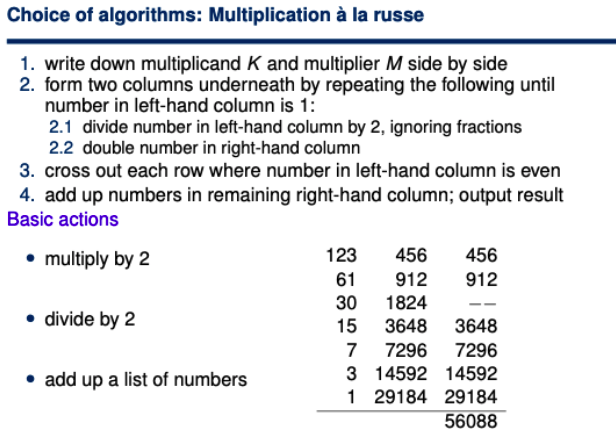

# Pseudocode: A language for algorithms

## Topics

* Essential features of algorithms
* Data storage and manipulation
* Control structures 

## Pseudocode Syntax Table

<table>
  <thead>
    <tr>
      <th style="text-align:left">Pseudocode</th>
      <th style="text-align:left">Description</th>
    </tr>
  </thead>
  <tbody>
    <tr>
      <td style="text-align:left">
        <p>do A</p>
        <p>do B</p>
        <p>do C</p>
      </td>
      <td style="text-align:left">
        <p>Run sequence of code A</p>
        <p>Run sequence of code B</p>
        <p>Run sequence of code C</p>
      </td>
    </tr>
    <tr>
      <td style="text-align:left">counter &lt;-- 0</td>
      <td style="text-align:left">Declare counter variable as 0</td>
    </tr>
    <tr>
      <td style="text-align:left">counter &lt;-- counter + 1</td>
      <td style="text-align:left">Add 1 to the counter variable</td>
    </tr>
  </tbody>
</table>

## Basic Operations

Basic operations counts as the arithmetic operations as well as control flow.

## Purpose of algorithms

An algorithm is designed for person to person communication. Programming languages therefore, are designed for person to computer communication. Algorithms are meant to be implemented on computers.

Algorithms sit halfway between excruciating detail needed for person to computer communication and informal English used for person to person communication. 

We need to remove vagueness from descriptions of algorithms, for example, "make a note of...", "proceed through the list of records...", etc. However, we still want to be able to understand what the algorithm is doing. 

Indexing in Pseudocode start at 1, not 0.

## Essential features of algorithms

The essential features of algorithms can be noted in the following sections \(Data storage - Arrays/Variables, and Control Structures\)

* Non self-referential

Turing complete refers to a language which can be used to perform an algorithm. It refers to an abstract machine which can be used to compute any computable problem using an infinitely long tape, a read and write head, used to access and modify the state of the tape, and a language used to control how the read write head can be moved. 

### Data storage - Variables

Variables are used to store data, they refer to a section in memory with some data inside it, and a type which refers to how the computer should read the data. 

In pseudocode, we define variables using a left arrow \(&lt;-\), for example

```text
x <- 3 # store the value `3` in the variable x
x <- 4 # overwrite the value in x to `4`
```

Variables can be written to and read from, and used in other calculations. For example:

```text
# read from salary and increment 
# variables, add them together, 
# and store the value in total
total <- salary + increment 

# read from counter, add 1 to it, 
# store the result in counter
counter <- counter + 1

# read from salary, multiply it by 5
# store the result in salary 
salary <- salary * 5
```

If a variable is on the right hand side of the assignment operator, the value within the variable is read from, if a variable is on the left side of the assignment operator, the value on the right side is written to the name of the variable. 

### Data storage - Arrays

In order to perform operations on one of the values in the collection, we require an index. In pseudocode, arrays are **not** zero indexed, indexing starts at 1, and ends at n. Where n is the total number of values stored in the collection. 

When an item in the array is accessed using its index, it can be operated on in the same way that a regular variable would be \(see section above\). 

In an array, the length is always known, and never changes. We use the notation in the following code snippet:

```text
A[1..n] has n boxes.
```

### Control structures 

All programming languages will offer some way of performing each of the following: 

#### Direct Sequencing 

Direct sequencing instructs the reader to do A, then do B, then do C, for each of the instructions in the algorithm.

#### Conditional Sequencing 

Control sequencing instructs the reader to do A if a certain condition is met, and to otherwise do B

#### Bounded iteration

Bounded iterations instructs the reader to do something exactly n times. The number of times the instructions are executed is known before the iterations begin 

```text
for i <- <start> to <finish> do
    <something> 
```

Pseudocode to do something an exact number of times. The variable i refers to the current iteration index, so on the first iteration, it will have a value of 

#### Example of bounded iteration

Summing the first n positive numbers

**Input**: positive number n

**Output:** sum of first n positive numbers

```text
sum <- 0
for i <- to n do
    sum <- sum + i
```


#### Conditional iteration

Conditional iteration instructs the reader to do something while some condition is true. It is not known how many times the instructions will be executed before the iteration begins. 

### Layout is important

When writing pseudocode, the indentation matters a lot as it shows which variables are within scope.

### Example - Swapping two values in an array

```text
if 1 < i < n and 1 < j < n then
    # Swap A[i] and A[j]
    temp <- A[i]
    A[i] <- A[j]
    A[j] <- temp
end
```

Assume A is an array with n elements

## Calculating salary bill

### Problem description

Legal inputs: any list of employee records, containing each of their salaries 

Required output: the total salary bill

### Algorithm

* Make a note of the number zero
* For each employee in the list, add their salary to the noted number
* Output the noted number

## Happy employees


## Towards pseudocode


## Algorithm Example: Multiplication A La Russe



To program this, you would use bitwise shifts.

## Summary 


