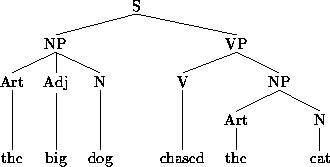

# Discipline Matures: Three Landmarks

## Prehistory of Cognitive Science

### Cognitive Science vs. Behaviourism

**Behaviourism** - Psychological movements sharing the assumption that psychologists should concern themselves with **observable phenomena** and **measurable behaviour**. All learning is either **reinforcement learning** or **classical conditioning.**

Behaviourism assumes all learning is the result of **conditioning**, and conditioning depends upon processes of **association** and **reinforcement**. e.g. Pavlov's dogs being conditioned to salivate at the sound of a dinner bell, and the Skinner Box, in which a rat becomes conditioned to perform behaviour with rewards and punishments.

**Classical Conditioning** - Strengthening of association between a  conditioned stimulus \(the ringing of a bell\), and an unconditioned stimulus \(presentation of food\) resulting in a behavioural response \(salivation\). 

### Tolman and Honzik, "'Insight' in Rats" \(1930\)

Tolman and Honzik disprove the notion that all learning is reinforced or conditioned through experiments on rats navigating mazes.

#### The Experient

Three groups of rats are made to navigate a maze. The first group receive rewards each time they successfully navigate the maze, the second receive no reward and the third are unrewarded for the first ten days.

#### The Results

The first group, motivated by food, learn to solve the maze as expected by the concept of behaviourism. The second and third groups seemed to wander aimlessly. Once rewarded, the third group manage to solve the maze faster than the first. 

The third group, Tolman and Honzik argue, must have memorised the layout of the maze despite having no reward, and thus, no reinforcement.

### Tolman, Ritchie, and Kalish, "Studies in Spacial Learning" \(1946\)

\*\*\*\*[**Spacial Learning**](https://link.springer.com/referenceworkentry/10.1007%2F978-1-4419-1428-6_44) **\(cognitive mapping, spatial memory\)** - refers to the process by which an organism acquires a mental representation of its environment. 

The experiment found that it was easier for animals to code spatial information in terms of places rather than in terms of particular sequences of movements. 

### Lashley, "The Problem of Serial Order in Behavior" \(1951\)

Complex behaviour can only be thought about in the previous two experiments as sequences of functions taking place one after another. Lashley argues that this is not the case and that behaviour is arranged hierarchically rather than linearly.

Complex behaviour should be thought about as the product of prior planning and organisation. Even simple plans can be broken down into even simpler ones. Despite being conscious of a high-level plan, most of the information processing happens at a subconscious level \(**subconscious information processing**\). 

The hypothesis of task analysis states that we can understand a complex system by breaking it down into subtasks. e.g. The memory system could be divided into subtasks for storing and retrieving information. Further down the hierarchy, the subtask for storing could be divided further into sub-subtasks for long and short-term storage.

## The Theory of Computation and the Idea of an Algorithm

### Algorithms and Turing Machines: Turing "On Computable Numbers, with an Application to the Decision Problem" \(1936-7\)

#### The Halting Problem

The problem of determining whether there is a purely mechanical procedure for working out whether certain basic mathematical problems have a solution. In other words, will a particular program given a particular input produce an output or loop endlessly.

#### The Turing Machine

Turing attempted to solve the Halting Problem algorithmically, by devising what we now call the Turing Machine. A Turing Machine reads a symbol at a time from an infinitely long piece of tape, using programmed instructions, or its Machine Table, it performs simple operations on the tape. The machine is purely mechanical, requiring no intuition or judgement. 

A Universal Turing Machine is a higher level Turing Machine that can run any specialised Turing Machine. It is the theoretical precursor to the general-purpose digital computer. 

#### The Church-Turing Thesis

Anything that can be done in mathematics by an algorithm can be done by a Turing Machine. Essentially, computers are large and fast Turing Machines.

## Linguistics and the Formal Analysis of Language

### The Structure of Language: Chomsky's Syntactic Structures \(1957\)

Chomsky provides a theoretical account of why languages have the structure that they do, making key distinctions between the **deep structure** of a sentence and its **surface structure**.

**Deep structure** is how the sentence or phrase is built from its constituent **syntactic categories** according to phrase structure rules; such as every sentence must have both a verb and noun phrase.

**Surface structure** is the actual organisation of the words within a sentence according to the principles of transformational grammar.

Sophisticated, hierarchically organised, cognitive ability, like speaking and understanding a language, involves stored bodies of information \(phrase structures and transformational rules\). These bodies of information can be manipulated algorithmically e.g. The phrase "The big dog chased the cat" where the big dog \(NP1\) is the subject, can be transformed making the cat \(NP2\) the subject.

## Information-Processing Models in Psychology

### How Much Information Can We Handle? George Miller's "The Magical Number Seven, Plus or Minus Two" \(1956\)

### The Flow of Information: Donald Broadbent's "The Role of Auditory Localization in Attention and Memory Span" \(1954\) and _Perception and Communication_ \(1958\)

## Connections and Points of Contact

